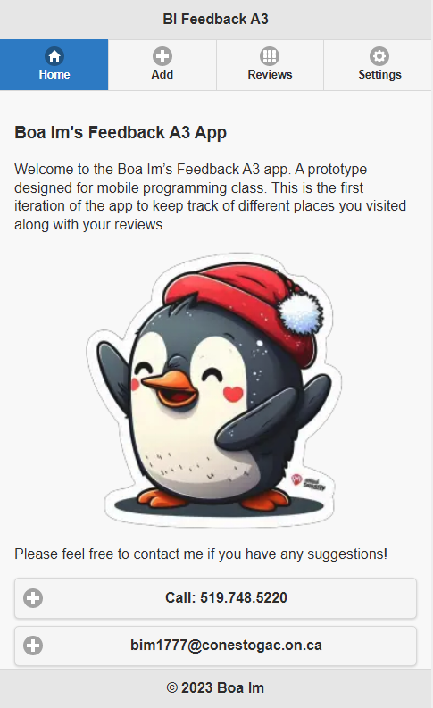
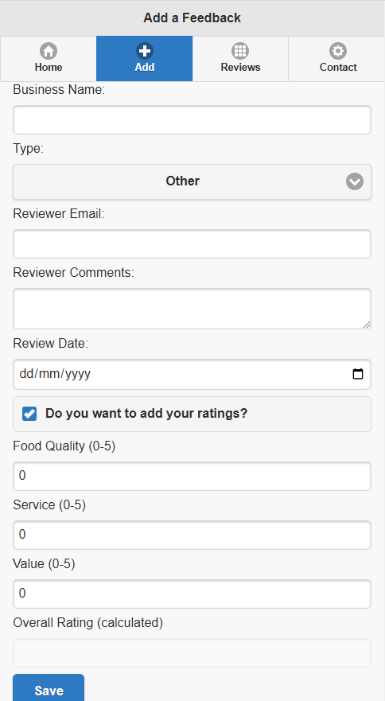
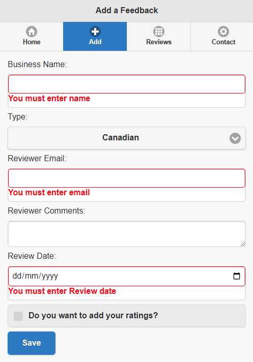
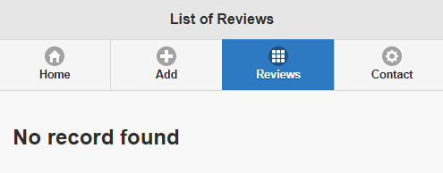
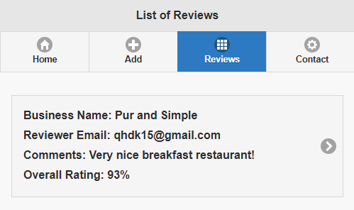
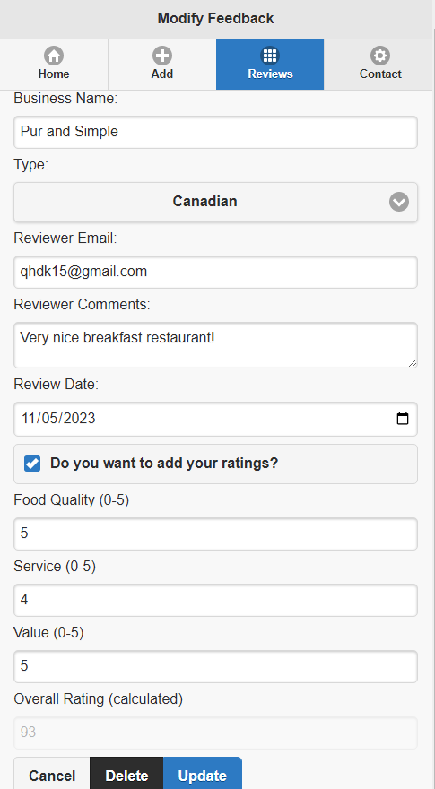
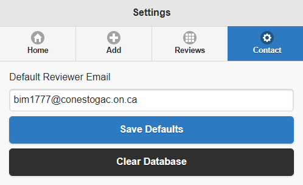

<h1>Restaurant Feedback App</h1>

This was made for an academic project of Mobile Application class at Conestoga College.

<ul>
  <li>Build a <strong>jQuery</strong> web app that allows customers to leave feedback on their dining experience</li>
  <li>CRUD the databases in <strong>Web SQL</strong> to manage customers’ information and feedbacks utilizing <strong>HTML</strong> and <strong>JavaScript</strong></li>
</ul>

  <h4>1. Home Page</h4>
  

  <h4>2. Add a feedback page</h4>
  
  
You can add a feedback into database
   The scores overall is calculated automatically

  <h4>3. Form Validation</h4>
  

  <h4>4. List of Reviews Page</h4>
  
  
If there is no reviews in database, it shows 'No Record Found' Message

  <h4>5. After Addind a review</h4>
  
  
This page reads the database and shows the reviews saved

  <h4>6. Modify Review Page</h4>
  
  
You can modify your review of one restaurant by clicking the list tab in List of Review Page

  <h4>7. Setting Page</h4>
  
  
You can save the email to default email to add a new feedback.
   And you can clear the database

